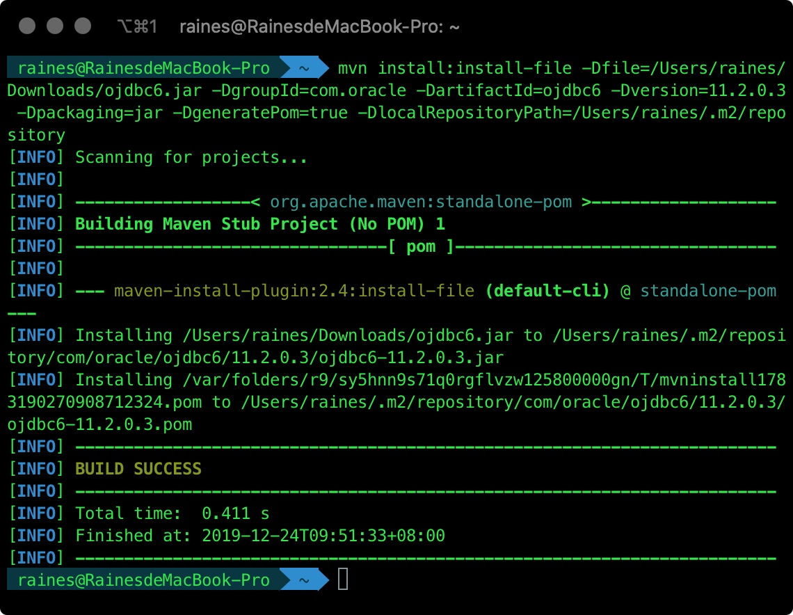

##以ojdbc6.jar为例 Maven手动导入jar包
一、pom文件依赖配置
    
       <dependency>
            <groupId>com.oracle</groupId>
            <artifactId>ojdbc6</artifactId>
            <version>11.2.0.3</version>
        </dependency>
            
二、下载ojdbc6.jar（http://www.oracle.com/technetwork/apps-tech/jdbc-112010-090769.html ）

三、通过控制台执行命令，将ojdbc.jar安装到本地库：

>mvn install:install-file -Dfile=/Users/raines/Downloads/ojdbc6.jar -DgroupId=com.oracle -DartifactId=ojdbc6 -Dversion=11.2.0.3 -Dpackaging=jar -DgeneratePom=true -DlocalRepositoryPath=/Users/raines/.m2/repository

成功安装到本地库：

四、说明

-DgroupId=com.oracle : 指定当前包的groupId为com.oracle

-DartifactId=ojdbc6 : 指定当前的artifactfactId为ojdbc6

-Dversion=11.2.0.3 : 指定当前包的version为11.2.0.3

-Dfile=A:\Develop\jar\ojdbc6.jar : 指定要打的包的文件位置

-DlocalRepositoryPath=/Users/raines/.m2/repository : 本地maven repo路径